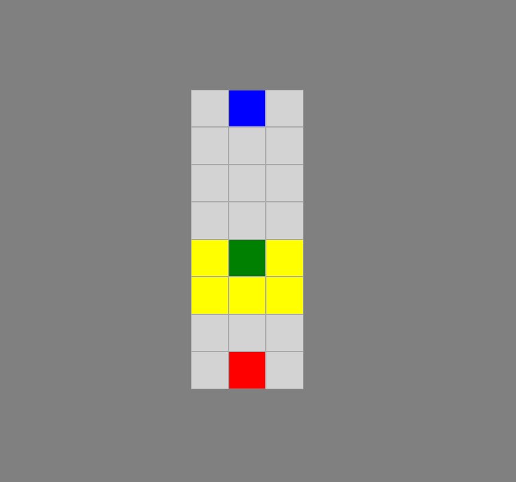

# FLIP

**--ARCHIVED--**

Flip is a Javascript adaptation of an application that I currently can't remember the name of. Flip was developed as a stand alone game but was abandoned at early stages and instead the project "FlopAI" was created to make use of the "block" style game board engine that Flip employs. This project is archived but may be revisited in the future to complete the basic game. It currently stands as a demonstration of the tile system and the idea behind the game.

## Development / Testing

The game was written in HTML so that it can be opened in Google Chrome and run. If you wish to continue development, simple clone or download the repository and open "app.html" in Google Chrome (Other web browsers may work but aren't necessarily supported). 

## Example

The current state of the game is completely hypothetical and has limited rules and implementation as well as no final state.

")

 

